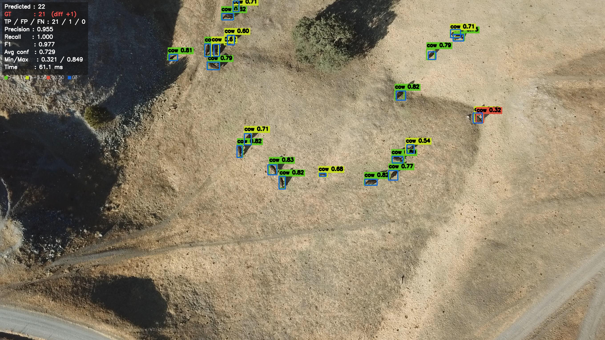
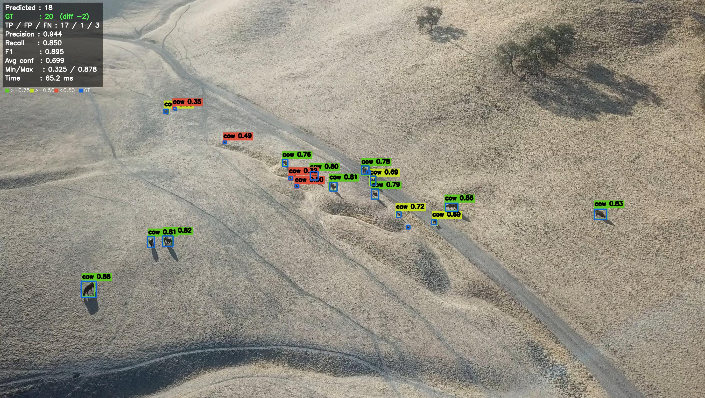
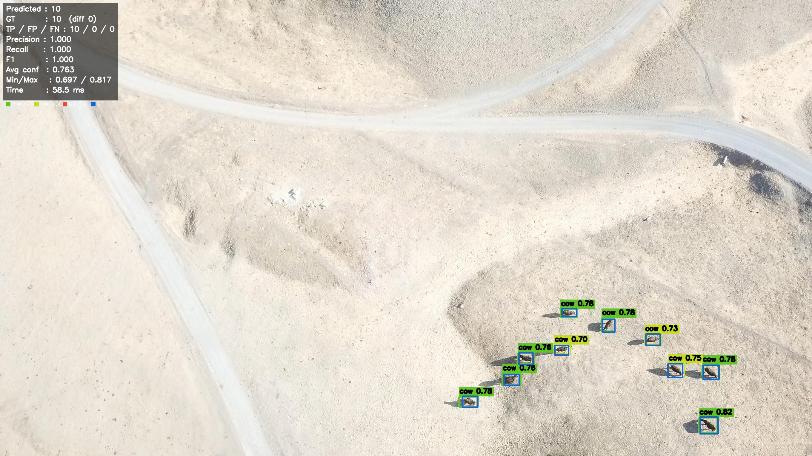
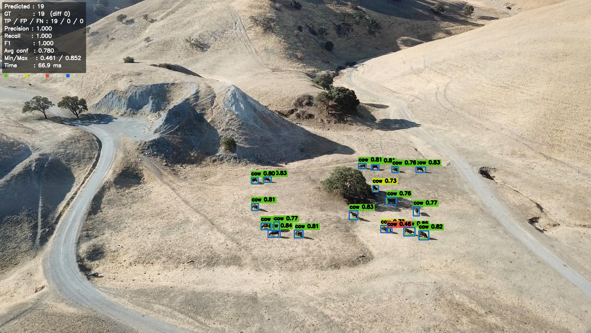

# 🐄 Aerial Cow Detection with RF-DETR

Real-time aerial cow detection and counting using **RF-DETR** (RFDETRBase) trained on drone/aerial imagery.

---
## 🖼️ Sample Detections

---

## 📊 Model Performance

| Metric | Score |
|---|---|
| AP @ 0.50 | **83.2%** |
| AP @ 0.50:0.95 | **44.3%** |
| Precision | **90.1%** |
| Recall | **85.5%** |
| F1 Score | **87.7%** |

Evaluated on held-out test set from the same distribution as training data.

---

## 🚀 How to Use

1. **Image tab** — Upload any aerial/drone image containing cows
2. **Video tab** — Upload a short aerial video (first 30s processed)
3. Click **Detect Cows** and see bounding boxes with confidence scores

### Confidence color coding
- 🟢 Green — confidence ≥ 0.75
- 🟡 Yellow — confidence ≥ 0.50  
- 🔴 Red — confidence < 0.50

---

## 🏗️ Model Details

- **Architecture**: RF-DETR (RFDETRBase)
- **Input resolution**: 672×672
- **Training**: 80 epochs, cosine LR schedule, EMA
- **Dataset**: Aerial cow imagery (775 train images, 1 class)
- **Hardware**: NVIDIA RTX 3060 12GB

---

## ⚠️ Limitations

- Optimized for aerial/drone footage at medium altitude
- Best results on brown/earthy terrain backgrounds
- Performance degrades on very high altitude or dense herds (>100 cows/frame)
- For dense scenes, tiled inference (SAHI) is recommended

---

Built by [evlogia-kyriou](https://huggingface.co/evlogia-kyriou) · Powered by [RF-DETR](https://github.com/roboflow/rf-detr)